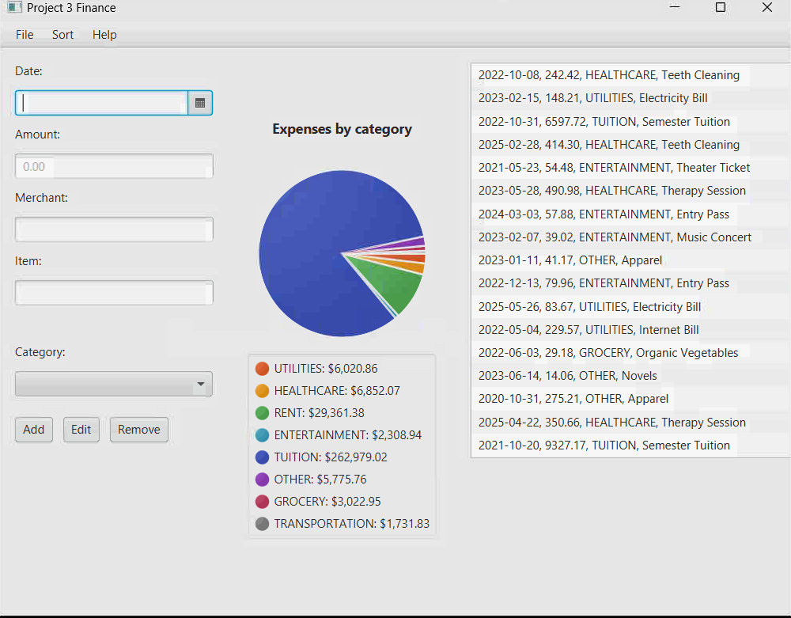

# finance-tracker
Personal finance management application built in Java. Import spreadsheet data, edit transactions directly, and visualize spending distribution across categories with dynamic pie charts.

# Finance Tracker

A Java desktop application for personal finance management that loads expense data from `.fin` files, provides transaction management capabilities, and visualizes spending patterns through an interactive pie chart with detailed breakdowns by category.

## Features

- **File Import/Export** - Load and save expense data using custom `.fin` file format
- **Transaction Management** - Add, edit, and remove expense entries with detailed information
- **Visual Analytics** - Interactive pie chart displaying spending distribution across 8 expense categories
- **Detailed Transaction View** - Side panel showing complete transaction history with date, amount, category, and description
- **Category-Based Organization** - Track expenses across categories including:
  - Utilities
  - Healthcare
  - Rent
  - Entertainment
  - Tuition
  - Grocery
  - Transportation
  - Other
- 💵 **Real-Time Calculations** - Automatic calculation and display of total spending per category

## Screenshots

### Main Interface

*Clean interface with input fields for date, amount, merchant, item, and category selection*

### File Loading

*Simple file dialog for loading `.fin` expense data files*

### Data Visualization

*Pie chart with category breakdown and complete transaction list showing real expense data*

## Technologies Used

- **Java** - Core programming language
- **Java FX** 
- **Custom File I/O** - `.fin` file format for data persistence

## Prerequisites

- Java Development Kit (JDK) 8 or higher
- Windows/Mac/Linux operating system

## How to Run

### Option 1: Using an IDE
1. Clone this repository:
   ```bash
   git clone https://github.com/CedricJ727/finance-tracker.git
   ```
2. Open the project in your preferred Java IDE (IntelliJ IDEA, Eclipse, NetBeans)
3. Navigate to the main class file
4. Run the application

### Option 2: Command Line
1. Clone the repository
2. Navigate to the source directory
3. Compile the Java files:
   ```bash
   javac *.java
   ```
4. Run the main class:
   ```bash
   java FinanceTrackerGUI
   ```

## Usage Guide

### Loading Expense Data
1. Click **File** → **Load Expense Data**
2. Select your `.fin` file from the file browser
3. Data will populate in the transaction list and pie chart

### Adding a Transaction
1. Enter the **Date** using the date picker
2. Input the **Amount** in decimal format (e.g., 242.42)
3. Specify the **Merchant** name
4. Enter the **Item** description
5. Select a **Category** from the dropdown
6. Click **Add** button

### Editing a Transaction
1. Select a transaction from the list on the right
2. Modify the fields as needed
3. Click **Edit** button to save changes

### Removing a Transaction
1. Select a transaction from the list
2. Click **Remove** button
3. The transaction will be deleted and charts will update

### Viewing Analytics
- The pie chart automatically updates to reflect all transactions
- Category totals are displayed with color-coded legend
- Total spending per category shown in dollar amounts

## File Format

The application uses a custom `.fin` file format to store expense data. Each transaction includes:
- Date (YYYY-MM-DD format)
- Amount (decimal)
- Category
- Merchant/Description


## Project Structure

```
finance-tracker/
├── src/
│   ├── FinanceTrackerGUI.java     # Main GUI application
│   ├── Transaction.java           # Transaction data model
│   ├── FileHandler.java           # File I/O operations
│   ├── PieChart.java              # Chart visualization
│   └── CategoryManager.java       # Category handling
├── screenshots/
│   ├── main_interface.png
│   ├── file_dialog.png
│   └── pie_chart_view.png
├── README.md
└── .gitignore
```

## What I Learned

This project helped me develop skills in:
- Java GUI development and event handling
- Custom file format design and implementation
- Data visualization 
- Object-oriented design with model-view separation
- User experience design for desktop applications
- File I/O operations and data persistence


## Technical Highlights

- **Custom Pie Chart Rendering**
- **Real-time Data Updates**: Charts and totals automatically recalculate on any data change
- **Clean MVVM Architecture**
- **Robust File Handling**: Error handling for file operations and data validation


## License

This project is open source and available under the MIT License.

## Contact

**Cedric Jones**
- GitHub: [@CedricJ727](https://github.com/CedricJ727)
- Feel free to reach out with questions or suggestions!

---

⭐ If you found this project helpful or interesting, please consider giving it a star!
